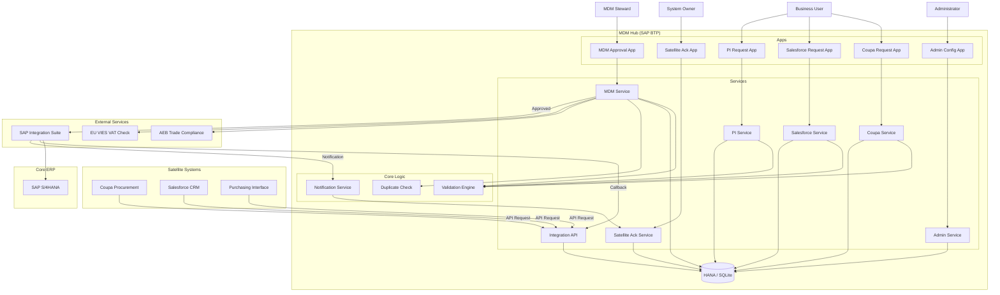

# System Architecture

## Overview

The Business Partner Management System is a centralized MDM (Master Data Management) hub built on the **SAP Cloud Application Programming (CAP)** model. It governs the creation and update of Business Partners (Suppliers, Customers) across an enterprise landscape that includes SAP S/4HANA and multiple satellite systems (Coupa, Salesforce, PI).

## Architecture Diagram

## Core Components

### 1. Data Model (`db/`)
The system is built around a central `BusinessPartnerRequests` entity. This entity is "projected" into different views for different applications (e.g., `CoupaRequests`, `SalesforceRequests`), allowing for tailored fields and logic while maintaining a single source of truth.

### 2. Services (`srv/`)
*   **Request Services** (`CoupaService`, `SalesforceService`, `PIService`): Handle the creation and submission of requests. They enforce app-specific validation rules.
*   **MDM Service** (`MDMService`): The governance layer. Allows approval, rejection, and compliance checks (AEB, VIES).
*   **Admin Service** (`AdminService`): Manages configuration data (Validation Rules, Code Lists).
*   **Integration API** (`IntegrationAPI`): Provides REST endpoints for inbound system-to-system requests.

### 3. Validation Framework
A dynamic, metadata-driven validation engine. Rules are stored in the database (`ValidationRules` entity) and applied at runtime. This allows business rules to be changed without code deployments.

### 4. Integration
*   **Inbound**: Satellite systems can push requests via the Integration API.
*   **Outbound**: When a request is approved, the system triggers an integration flow (via SAP Integration Suite/CPI) to create the Business Partner in SAP S/4HANA.
*   **Feedback**: SAP returns the generated Business Partner Number (e.g., `1000001234`), which is written back to the request and notified to the satellite systems.

## Data Flow: Request Lifecycle

1.  **Creation**: A user (via UI) or system (via API) creates a `Draft` request.
2.  **Submission**: The request is validated. If valid, status changes to `Submitted`.
3.  **Review**: MDM Steward picks up the request.
    *   **Compliance**: Automated/Manual checks for Sanctions (AEB) and VAT (VIES).
    *   **Duplicates**: Check against existing SAP data.
4.  **Decision**:
    *   **Reject**: Request returns to user for correction (Status: `Rejected`).
    *   **Approve**: Request is locked and queued for integration (Status: `Approved`).
5.  **Integration**:
    *   System sends payload to CPI.
    *   CPI creates BP in S/4HANA.
    *   S/4HANA returns new BP Number.
    *   CPI updates MDM Hub with BP Number.
6.  **Notification**:
    *   System generates notifications for all relevant Satellite Systems.
    *   System Owners acknowledge receipt via Satellite Ack App.
    *   Status moves to `Completed`.
