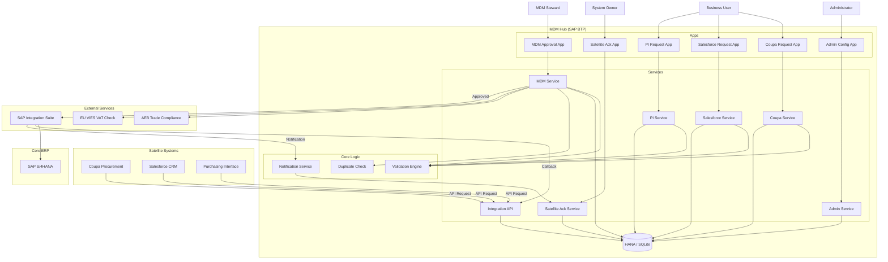

# System Architecture

## Overview

The Business Partner Management System is a centralized MDM hub built on the **SAP Cloud Application Programming (CAP)** model. It governs the creation and update of Business Partners (Suppliers, Customers) across an enterprise landscape.

## Architecture Diagram

## Core Components

### 1. Data Model
The system is built around a central `BusinessPartnerRequests` entity. This entity is "projected" into different views for different applications (e.g., `CoupaRequests`, `SalesforceRequests`).

### 2. Services
*   **Request Services**: Handle the creation and submission of requests.
*   **MDM Service**: The governance layer. Allows approval, rejection, and compliance checks.
*   **Admin Service**: Manages configuration data.
*   **Integration API**: REST endpoints for inbound requests.

### 3. Validation Framework
A dynamic, metadata-driven validation engine. Rules are stored in the database (`ValidationRules` entity) and applied at runtime.

### 4. Integration
*   **Inbound**: Satellite systems push requests via the Integration API.
*   **Outbound**: Approved requests trigger an integration flow (via CPI) to SAP S/4HANA.
*   **Feedback**: SAP returns the generated BP Number, which is written back to the request.

## Data Flow: Request Lifecycle

1.  **Creation**: A request is created in `Draft` status.
2.  **Submission**: Validated request changes to `Submitted`.
3.  **Review**: MDM Steward performs compliance/duplicate checks.
4.  **Decision**:
    *   **Reject**: Returns to user (`Rejected`).
    *   **Approve**: Queued for integration (`Approved`).
5.  **Integration**:
    *   Payload sent to CPI -> S/4HANA.
    *   S/4HANA returns BP Number.
    *   MDM Hub updated with BP Number.
6.  **Notification**: Satellite Systems notified; System Owners acknowledge (`Completed`).
