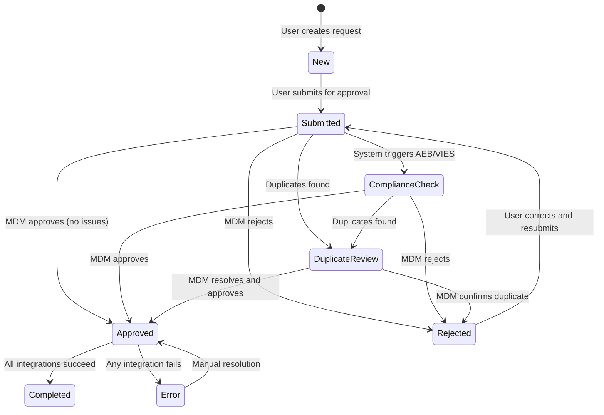

# Functional Specification: MDM Approval App

**Version:** 6.0
**Date:** 2026-01-17
**Status:** Draft

---

## 1. Introduction

### 1.1 Purpose

The MDM Approval App is the central governance hub of the Business Partner Management System. It serves as the control center where Master Data Management (MDM) Stewards exercise oversight over all Business Partner requests before they are synchronized to SAP S/4HANA.

In a multi-channel environment where requests originate from Salesforce, Coupa, and the PI legacy system, the MDM Approval App provides a unified view of all pending work. This consolidation is critical for maintaining data quality, preventing duplicates, ensuring regulatory compliance (AEB sanctions screening, VIES VAT validation), and enforcing consistent business rules across the enterprise.

The application follows a "four-eyes principle" - the person requesting a Business Partner cannot also approve it. This separation of duties ensures that every partner record in SAP has been vetted by a qualified MDM Steward before creation.

### 1.2 Target Audience

**MDM Stewards** are the primary users of this application. These are experienced master data professionals who understand:
- Business Partner structures in SAP S/4HANA
- Regulatory requirements for partner data (tax compliance, sanctions screening)
- Data quality standards and duplicate detection
- The business context of different satellite systems (Salesforce for customers, Coupa for suppliers)

**Integration Support Teams** may also use this application to monitor the status of integrations and troubleshoot failed synchronizations.

### 1.3 Cross-References

| Document | Description |
|:---|:---|
| [Common Architecture](file:///c:/Users/msudarsanan/.gemini/antigravity/brain/4c48700f-4a4c-4049-97a6-ff6f1821b397/Functional_Spec_Common_Architecture.md) | Shared data model, validation framework, and complete code lists |
| [Compliance Integration](file:///c:/Users/msudarsanan/.gemini/antigravity/brain/4c48700f-4a4c-4049-97a6-ff6f1821b397/Compliance_Integration_Specification.md) | Detailed AEB and VIES API schemas and implementation |
| [Integration Request Schema](file:///c:/Users/msudarsanan/.gemini/antigravity/brain/4c48700f-4a4c-4049-97a6-ff6f1821b397/Integration_Request_Schema.md) | CPI payload formats for SAP integration |

---

## 2. Business Context

### 2.1 The Problem MDM Solves

Without centralized MDM governance, organizations face several challenges:

1. **Duplicate Partners**: Different departments create the same business partner multiple times, leading to fragmented data and reconciliation issues.

2. **Compliance Risk**: Partners on sanctions lists or with invalid tax registrations are onboarded without proper screening.

3. **Data Quality Issues**: Incomplete addresses, invalid bank details, and inconsistent naming conventions cause downstream processing errors.

4. **Audit Failures**: Without a clear approval trail, organizations cannot demonstrate who approved which partner and when.

### 2.2 How MDM Approval Addresses These Challenges

The MDM Approval App provides:

- **Unified Queue**: All requests from all source systems appear in a single inbox, ensuring nothing is missed.
- **Compliance Checks**: Automated AEB sanctions screening and VIES VAT validation before approval.
- **Duplicate Detection**: Fuzzy name matching and exact VAT ID comparison to identify potential duplicates.
- **Audit Trail**: Complete history of who approved/rejected each request with timestamps and comments.
- **Integration Tracking**: Real-time visibility into SAP synchronization status.

---

## 3. User Interface Overview

### 3.1 Dashboard (Worklist)

The dashboard presents a worklist of all Business Partner requests requiring attention. MDM Stewards typically start their day here, filtering to see pending requests.

**Key UI Elements:**

| Element | Description |
|:---|:---|
| **Smart Filter Bar** | Filter by status, source system, date range, partner name |
| **Request Table** | Lists all requests with key information at a glance |
| **Status Indicators** | Color-coded badges showing request status |
| **Quick Actions** | Approve/Reject directly from the list (for simple cases) |

**Table Columns:**

The table displays the following information to help MDM Stewards prioritize their work:

| Column | Description | Why It Matters |
|:---|:---|:---|
| Request Number | Unique identifier | Reference for communication |
| Partner Name | Business Partner name | Quick identification |
| Source System | Salesforce, Coupa, PI | Context for validation rules |
| Request Type | Create or Change | Different review focus |
| Status | Current workflow status | What action is needed |
| AEB Status | Compliance check result | Critical for approval decision |
| Created At | Submission timestamp | SLA tracking |
| Requester | Who submitted | Four-eyes principle verification |

### 3.2 Detail Page

Clicking a request opens the detail page, which provides comprehensive information for the MDM Steward's review.

**Header Section:**
The header prominently displays the partner name, request number, and current status. This gives immediate context when switching between requests.

**Object Page Sections:**

The MDM Approval App displays more sections than the satellite request apps because it includes compliance and governance data:

| Section | Content | Purpose |
|:---|:---|:---|
| **General Information** | Partner name, type, entity type, source system, requester | Core identity data |
| **Payment Information** | Payment terms, payment method, currency | Financial setup |
| **Addresses** | All partner addresses with type identification | Location data validation |
| **Bank Accounts** | Banking details including IBAN, SWIFT | Payment processing setup |
| **Emails** | Email contacts with types | Communication setup |
| **VAT IDs** | Tax registration numbers by country | Tax compliance |
| **Identifications** | Business identifiers (DUNS, Tax ID, Satellite IDs) | External system linking |
| **AEB Compliance** | Sanctions screening results | Go/no-go decision support |
| **VIES Validation** | VAT number verification results | EU VAT compliance |
| **Duplicate Partners** | Potential duplicate matches found | Duplicate prevention |
| **Change Log** | For Change requests, field-level differences | Impact assessment |
| **Approval History** | Who did what and when | Audit trail |

---

## 3.3 Section Details

### 3.3.1 General Information Section

Displays core partner identity information:

| Field | Description | Editable by MDM |
|:---|:---|:---|
| Partner Name | Full business name | Yes (data enrichment) |
| Name 1-4 | Structured name components | Yes |
| Search Term | Short search key | Yes |
| Entity Type | Customer, Supplier, Both | No |
| BP Type | Organization or Person | No |
| Source System | Salesforce, Coupa, PI | No |
| Request Type | Create or Change | No |
| Requester | Who submitted the request | No |
| Requester Email | Contact for clarifications | No |

### 3.3.2 Payment Information Section

Displays payment configuration:

| Field | Description | Editable by MDM |
|:---|:---|:---|
| Payment Terms | When payment is due (NET30, etc.) | Yes |
| Payment Method | How payment is made | Yes |
| Currency | Default transaction currency | Yes |

### 3.3.3 Addresses Section

Table displaying all partner addresses:

| Column | Description |
|:---|:---|
| Address Type | Business, Shipping, Remit-To |
| Street | Street address |
| City | City name |
| Postal Code | Postal/ZIP code |
| Country | Country code |
| Phone | Phone number |
| Default | Is default address |

### 3.3.4 AEB Compliance Section

**Purpose:** Displays results of AEB sanctions screening.

| Field | Description | Values |
|:---|:---|:---|
| AEB Status | Overall screening result | Pass, Warning, Blocked |
| AEB Check Date | When screening was performed | DateTime |
| Risk Score | Numerical risk assessment | 0-100 |
| Screening ID | Reference for audit | AEB-generated ID |

**Status Indicators:**
- 🟢 **Pass** (score 0-29): No matches found, safe to approve
- 🟡 **Warning** (score 30-69): Potential match, manual review recommended
- 🟠 **Review** (score 70-89): Likely match, manual review required
- 🔴 **Blocked** (score 90-100): High-risk match, **approval blocked**

**Hits Table (if matches found):**
| Column | Description |
|:---|:---|
| List Name | Which sanctions list (OFAC, EU, UN, UK) |
| Match Score | How closely it matches (0-100) |
| Matched Name | Name on the sanctions list |
| Remarks | Additional information |

### 3.3.5 VIES Validation Section

**Purpose:** Displays results of EU VAT number validation.

| Field | Description | Values |
|:---|:---|:---|
| VIES Status | Validation result | Valid, Invalid, Error |
| VIES Check Date | When validation was performed | DateTime |
| Registered Name | Company name from VIES | String (if valid) |
| Registered Address | Address from VIES | String (if valid) |

**Status Indicators:**
- 🟢 **Valid**: VAT number is registered and active
- 🔴 **Invalid**: VAT number not found in VIES database
- 🟡 **Error**: VIES service unavailable, retry later

**Name/Address Comparison:**
The system displays the VIES-returned name/address alongside the request data so MDM can verify consistency.

### 3.3.6 Duplicate Partners Section

**Purpose:** Displays potential duplicate Business Partners found in SAP.

| Field | Description |
|:---|:---|
| SAP BP Number | Existing partner's BP number |
| Partner Name | Existing partner's name |
| Match Type | How the match was found (Name, VAT, DUNS) |
| Match Score | Similarity percentage (0-100) |
| Status | Status of existing partner |

**Match Types:**
- **VAT Match**: Exact VAT ID already exists (very high confidence)
- **DUNS Match**: Exact DUNS number already exists (very high confidence)
- **Name Match**: Similar partner name found (fuzzy matching)

**MDM Actions:**
- Review existing partner to confirm if duplicate
- Approve anyway if false positive
- Reject if true duplicate exists

### 3.3.7 Change Log Section (Change Requests Only)

**Purpose:** For Change requests, shows exactly what changed compared to original SAP data.

| Column | Description |
|:---|:---|
| Field | Which field was modified |
| Entity | Which entity (Address, Bank, etc.) |
| Old Value | Previous value in SAP |
| New Value | Requested new value |
| Change Type | Modified, Created, Deleted |

**Change Types:**
- **Modified**: Existing record was changed
- **Created**: New record added
- **Deleted**: Record marked for deletion

### 3.3.8 Approval History Section

| Column | Description |
|:---|:---|
| Timestamp | When the action occurred |
| User | Who performed the action |
| Action | What was done (Submitted, Approved, Rejected) |
| Comments | Any notes provided |

---

## 4. State Transition Logic

### 4.1 Understanding the Request Lifecycle

Every Business Partner request follows a defined lifecycle from creation to completion. Understanding this lifecycle is essential for MDM Stewards to know what actions are available at each stage.

**The Typical Happy Path:**

```
User Creates Request → Submits → MDM Reviews → Approves → SAP Syncs → Completed
```

**Exceptions and Alternative Paths:**

- If compliance checks flag issues, the request may require additional review
- If duplicates are found, the MDM Steward must resolve them before proceeding
- If the MDM Steward finds data quality issues, they can reject with a detailed reason
- If SAP integration fails, the request moves to Error status for investigation

### 4.2 Status State Machine

The following diagram shows all possible status transitions:



### 4.3 Status Definitions

**New**: The request has been created by a user in a satellite system but has not yet been submitted. In this state, the user can still make changes. Once submitted, the request becomes immutable from the satellite system's perspective.

**Submitted**: The request is now in the MDM queue awaiting review. The MDM Steward can see it in their worklist and take action. This is the primary "work" status for the MDM team.

**ComplianceCheck**: The system has triggered automated compliance checks (AEB sanctions screening, VIES VAT validation). The request remains in this status while checks are in progress. MDM Stewards can still review the request data but should wait for check results before approving.

**DuplicateReview**: The duplicate detection algorithm has found potential matches. The MDM Steward must review the matches and decide whether to:
- Proceed with approval (false positive)
- Reject the request (confirmed duplicate)
- Merge with an existing partner (manual process)

**Approved**: The MDM Steward has approved the request. At this point, the system queues the request for SAP integration via CPI. Three sub-statuses track the integration progress.

**Rejected**: The MDM Steward has rejected the request with a reason. The requester is notified and can correct the issues and resubmit.

**Completed**: All integrations have succeeded. The Business Partner now exists in SAP and the satellite system has been notified with the SAP BP Number.

**Error**: One or more integrations failed. Manual intervention is required to investigate and resolve.

### 4.4 Integration Status Tracking (After Approval)

When a request is approved, it doesn't immediately complete. Three separate integration steps must succeed:

| Status Field | What It Tracks | When It Updates |
|:---|:---|:---|
| `sapInitialStatus` | SAP Business Partner creation/update | CPI callback after SAP API call |
| `satelliteStatus` | Notification to source system | CPI callback after satellite notification |
| `sapIdUpdateStatus` | SAP ID written back to request | CPI callback after ID update |

**Completion Logic:**

The overall status transitions to "Completed" only when ALL THREE integration statuses are "Success". If ANY status becomes "Error", the overall status transitions to "Error".

```
IF sapInitialStatus = "Success"
   AND satelliteStatus = "Success"
   AND sapIdUpdateStatus = "Success"
THEN overall status → "Completed"

IF sapInitialStatus = "Error"
   OR satelliteStatus = "Error"
   OR sapIdUpdateStatus = "Error"
THEN overall status → "Error"
```

---

## 5. MDM Actions and Button Behaviors

### 5.1 Approve Request

**When to Use:** The MDM Steward has reviewed the request, verified data quality, confirmed compliance checks are clear, and is satisfied that the partner should be created in SAP.

**Button Properties:**

| Property | Value |
|:---|:---|
| Label | "Approve" |
| Type | Emphasized (Primary) - Green tinted |
| Icon | sap-icon://accept |
| Visibility | Status is Submitted, ComplianceCheck, or DuplicateReview |
| Enabled | AEB Status is NOT "Blocked" |

**Confirmation Dialog:**

When the MDM Steward clicks Approve, a confirmation dialog appears:

- **Title**: "Approve Request"
- **Message**: "Are you sure you want to approve this request? This will trigger synchronization to SAP S/4HANA and notify the requesting system."
- **Optional Input**: Approver Comments (TextArea, max 500 characters)
- **Buttons**:
  - "Approve" (Primary) - Proceeds with approval
  - "Cancel" - Returns to detail page

**What Happens After Approval:**

1. System validates that AEB Status is not "Blocked"
2. If blocked, shows error: "Cannot approve - partner is on a sanctions list"
3. Otherwise:
   - Updates status to "Approved"
   - Records approver ID and timestamp
   - Stores approver comments
   - Triggers notification email to requester
   - Queues request for CPI integration
   - Sets all three integration statuses to "Pending"
4. Shows success message: "Request approved successfully"
5. Page becomes read-only

### 5.2 Reject Request

**When to Use:** The MDM Steward has found issues that cannot be resolved without changes from the requester. Common reasons include:
- Missing mandatory information
- Invalid data formats
- Confirmed duplicate (partner already exists)
- Failed compliance checks
- Business policy violations

**Button Properties:**

| Property | Value |
|:---|:---|
| Label | "Reject" |
| Type | Negative (Destructive) - Red tinted |
| Icon | sap-icon://decline |
| Visibility | Status is Submitted, ComplianceCheck, or DuplicateReview |
| Enabled | Always (when visible) |

**Rejection Dialog:**

The rejection dialog REQUIRES a reason - the requester needs to understand why their request was rejected and what to fix.

- **Title**: "Reject Request"
- **Message**: "Please provide a reason for rejection. This will be sent to the requester."
- **Required Input**: Rejection Reason (TextArea, minimum 10 characters, max 500 characters)
- **Buttons**:
  - "Reject" (Negative) - Proceeds with rejection
  - "Cancel" - Returns to detail page

**What Happens After Rejection:**

1. System validates that a rejection reason was provided
2. If no reason, shows error: "Please provide a rejection reason (minimum 10 characters)"
3. Otherwise:
   - Updates status to "Rejected"
   - Records rejector ID and timestamp
   - Stores rejection reason
   - Triggers notification email to requester with rejection reason
4. Shows message: "Request rejected"
5. Navigates back to worklist

### 5.3 Check Duplicates

**When to Use:** The MDM Steward wants to verify whether a similar Business Partner already exists in SAP or in other pending requests. This is often done as part of the standard review process, especially for new partner requests.

**Button Properties:**

| Property | Value |
|:---|:---|
| Label | "Check Duplicates" |
| Type | Default |
| Icon | sap-icon://duplicate |
| Visibility | Status is Submitted or ComplianceCheck |
| Enabled | Always (when visible) |

**Pre-Check Confirmation:**

- **Title**: "Check for Duplicates"
- **Message**: "This will search for existing Business Partners with matching VAT IDs or similar names. This may take a few moments."
- **Buttons**: "Check" (Primary), "Cancel"

**What Happens During Check:**

1. Shows busy indicator: "Searching for duplicates..."
2. Calls duplicate detection service
3. Service checks:
   - Exact VAT ID matches in SAP
   - Exact VAT ID matches in pending requests
   - Fuzzy name matches (using configurable similarity threshold)
4. Returns results

**Results Dialog (No Duplicates Found):**

- **Title**: "Duplicate Check Results"
- **Message**: "No potential duplicates were found."
- **Icon**: Green checkmark
- **Button**: "Close"

**Results Dialog (Duplicates Found):**

- **Title**: "Duplicate Check Results"
- **Message**: "The following potential duplicates were found. Please review before proceeding."

**Results Table:**

| Column | Description |
|:---|:---|
| Match Score | Percentage similarity (0-100%) |
| Partner Name | Matched partner's name |
| SAP BP Number | If exists in SAP |
| Request Number | If pending request |
| Match Type | VAT (exact), Name (fuzzy), Combined |
| City, Country | Location for verification |

**Actions in Results Dialog:**
- "View Details" - Opens the matched partner/request
- "Mark False Positive" - Records that this is not a duplicate
- "Close" - Returns to detail page
- "Proceed with Approval" - If MDM Steward confirms not a duplicate

If duplicates are found and the request is not already in DuplicateReview status, the status is updated to DuplicateReview.

### 5.4 Perform AEB Check

**When to Use:** The MDM Steward wants to screen the Business Partner against global sanctions lists. This is typically done automatically when a request is submitted, but can be re-run if:
- Address information was corrected
- A previous check encountered an error
- The MDM Steward wants to verify against updated sanctions lists

**Button Properties:**

| Property | Value |
|:---|:---|
| Label | "Perform AEB Check" |
| Type | Default |
| Icon | sap-icon://shield |
| Visibility | Always visible |
| Enabled | Request has at least one address |

**Pre-Check Confirmation:**

- **Title**: "Trade Compliance Screening"
- **Message**: "This will screen the Business Partner against global sanctions lists including OFAC (US), EU, UN, and UK sanctions. This may take a few moments."
- **Buttons**: "Screen" (Primary), "Cancel"

**What Happens During Check:**

1. Shows busy indicator: "Screening against sanctions lists..."
2. Calls AEB (Asian Economic Bank / Trade Compliance) service
3. Service screens partner name and addresses against:
   - OFAC Specially Designated Nationals (SDN) List
   - EU Consolidated Sanctions List
   - UN Security Council Consolidated List
   - UK Sanctions List
4. Calculates risk score based on matches
5. Returns status: Pass, Warning, or Blocked

**Results Dialog:**

The dialog appearance depends on the result:

**Pass (Green):**
- Icon: Green checkmark
- Message: "No matches found on sanctions lists. This partner appears clear for business."

**Warning (Yellow):**
- Icon: Yellow warning triangle
- Message: "Potential matches found. Review the findings below before proceeding."
- Shows table of potential matches with match scores

**Blocked (Red):**
- Icon: Red stop sign
- Message: "**BLOCKED** - This partner appears on one or more sanctions lists. Approval is not possible without compliance review."
- Shows table of confirmed matches
- The Approve button becomes disabled

### 5.5 Perform VIES Check

**When to Use:** The MDM Steward wants to validate that a European VAT number is properly registered with the EU VIES (VAT Information Exchange System) database. This is important for:
- Verifying the partner is a legitimate business entity
- Confirming the company name and address match registrations
- Ensuring tax compliance for intra-EU transactions

**Button Properties:**

| Property | Value |
|:---|:---|
| Label | "Perform VIES Check" |
| Type | Default |
| Icon | sap-icon://validate |
| Visibility | Request has EU VAT ID (starts with EU country code) |
| Enabled | VAT ID is present |

**Pre-Check Confirmation:**

- **Title**: "VAT Number Validation"
- **Message**: "This will validate the VAT number(s) against the official EU VIES database. This may take a few moments."
- **Buttons**: "Validate" (Primary), "Cancel"

**What Happens During Check:**

1. Shows busy indicator: "Validating VAT number with EU VIES..."
2. Calls EU VIES SOAP service
3. Service validates:
   - VAT number format is correct for the country
   - VAT number is registered and active
   - Returns registered company name and address
4. Caches result for 24 hours to avoid redundant calls

**Results Dialog:**

**Valid (Green):**
- Icon: Green checkmark
- Message: "VAT number is valid and registered with VIES."
- Shows registered company information:
  - Registered Name: {from VIES}
  - Registered Address: {from VIES}
  - Validation Date: {timestamp}

**Invalid (Red):**
- Icon: Red X mark
- Message: "VAT number is NOT registered in the EU VIES database. Please verify the number is correct."

**Error (Yellow):**
- Icon: Yellow warning
- Message: "The VIES service is currently unavailable. Please try again later."

---

## 6. Change Log Section

### 6.1 Purpose

For **Change** requests (updates to existing SAP Business Partners), the Change Log section shows exactly what fields are being modified. This helps the MDM Steward understand:
- The scope of changes being requested
- Whether the changes are reasonable
- What data will be affected in SAP

### 6.2 How Changes Are Tracked

When a user imports an existing SAP Business Partner and makes modifications, the system compares:
- **Original Data**: The data as it currently exists in SAP
- **Requested Changes**: The modifications the user has made

For each difference, a Change Log entry is created with:
- Which section (General, Address, Bank, etc.)
- Which field was changed
- The old value
- The new value
- The type of change (Created, Modified, Deleted)

### 6.3 User Interface

The Change Log appears as a table in a collapsible panel on the detail page, visible only for Change requests.

| Column | Description |
|:---|:---|
| Section | Which part of the BP was changed |
| Field | Human-readable field label |
| Change Type | Icon indicating Created, Modified, or Deleted |
| Old Value | Previous value (blank for new items) |
| New Value | New value (blank for deleted items) |
| Record | Identifier for child records (e.g., "Address #1") |

### 6.4 Example

For a partner update that changes the address and adds a new bank account:

| Section | Field | Type | Old Value | New Value | Record |
|:---|:---|:---|:---|:---|:---|
| General | Partner Name | Modified | "Acme Corp" | "Acme Corporation" | - |
| Address | Street | Modified | "Main St 1" | "123 Main Street" | Address #1 |
| Address | Postal Code | Modified | "10115" | "10117" | Address #1 |
| Bank | - | Created | - | - | Bank #2 |
| Bank | IBAN | Created | - | "DE89..." | Bank #2 |
| Bank | SWIFT | Created | - | "COBADEFF" | Bank #2 |

---

## 7. API Endpoints

The MDM Approval App is an internal governance tool. Unlike the satellite system apps (Salesforce, Coupa, PI), it does not expose APIs for external system integration. All operations are performed through the Fiori UI by authenticated MDM Stewards.

**Internal OData Endpoints (UI Only):**

| Endpoint | Method | Description |
|:---|:---|:---|
| `/MDMApprovalRequests` | GET | List all requests in worklist |
| `/MDMApprovalRequests({ID})` | GET | Get request details |
| `/MDMApprovalRequests({ID})` | PATCH | Update MDM-editable fields |
| `/MDMApprovalRequests({ID})/approveRequest` | POST | Approve the request |
| `/MDMApprovalRequests({ID})/rejectRequest` | POST | Reject with reason |
| `/MDMApprovalRequests({ID})/checkDuplicates` | POST | Run duplicate detection |
| `/MDMApprovalRequests({ID})/performAEBCheck` | POST | Run AEB screening |
| `/MDMApprovalRequests({ID})/performVIESCheck` | POST | Run VIES validation |
| `/MDMApprovalRequests({ID})/changeLogs` | GET | Get change log entries |
